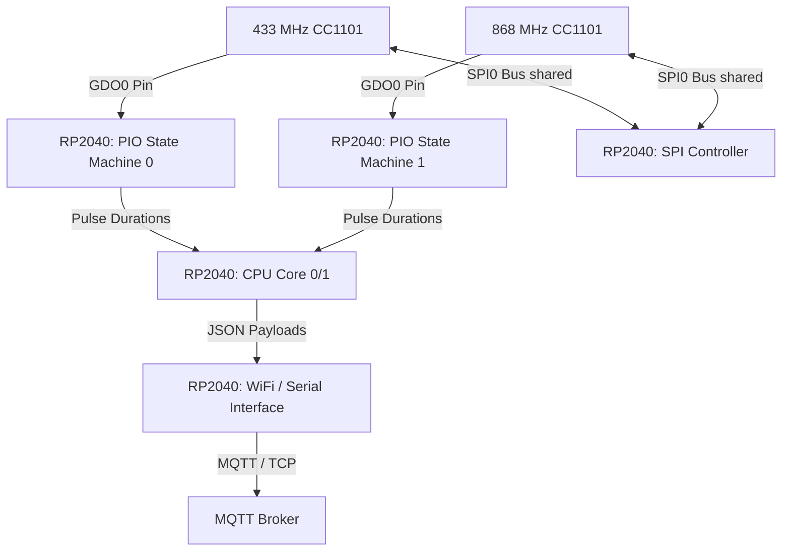
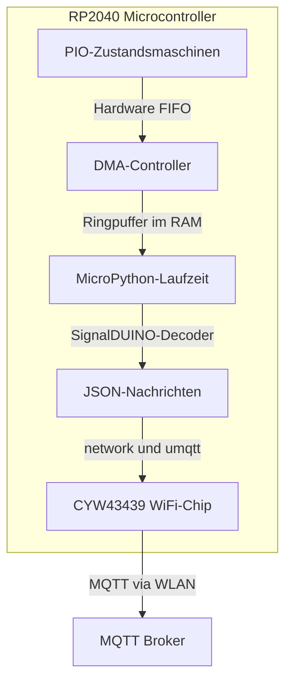

# signalrpi: RF-Empfänger für Smart-Home-Komponenten (433 & 868 MHz)

Dieses Projekt realisiert einen softwarebasierten Funkempfänger für die Frequenzbänder **433 MHz** (LPD-Band) und **868 MHz** (SRD-Band) (im Kontext oft als 443 und 886 MHz referenziert). Die Hardware-Basis bildet ein **RP2040**-Microcontroller (z. B. Raspberry Pi Pico oder Pico W), an den zwei **CC1101**-Transceiver-Module direkt über SPI angebunden sind. Die Dekodierungslogik wird aus dem Open-Source-Projekt **SignalDUINO** portiert. Die dekodierten Daten oder Pulse werden über ein strukturiertes **MQTT-Protokoll** zur weiteren Verarbeitung bereitgestellt.

---

## 1. Systemarchitektur & Hardware-Topologie

Die zeitkritische Erfassung der Signalflanken (im Bereich von $100\,\mu\text{s}$ bis $1000\,\mu\text{s}$) wird direkt auf dem RP2040-Microcontroller ausgeführt. Durch die Nutzung der programmierbaren I/O-Blöcke (**PIO**) des RP2040 können die Puls- und Pausendauern deterministisch und jitterfrei erfasst werden, ohne die CPU-Kerne zu belasten.



### 1.1 Pin-Belegung (RP2040 zu CC1101)

Die beiden CC1101-Module teilen sich den primären SPI0-Bus des RP2040. Die Selektion der Module erfolgt über separate Chip-Select-Leitungen (CSn). Die Demodulationssignale werden über die GDO0-Pins der CC1101-Module an GPIOs geführt, die von den PIO-State-Machines überwacht werden.

| CC1101-Funktion | CC1101 #1 (433 MHz) | CC1101 #2 (868 MHz) | RP2040 Pin | Beschreibung |
| :--- | :--- | :--- | :--- | :--- |
| **VCC** | VCC (3.3V) | VCC (3.3V) | **3V3(OUT)** | Spannungsversorgung (3.3 V) |
| **GND** | GND | GND | **GND** | Masse |
| **MOSI** | SI | SI | **GP19 (SPI0 TX)** | SPI Data Out |
| **MISO** | SO | SO | **GP16 (SPI0 RX)** | SPI Data In |
| **SCLK** | SCLK | SCLK | **GP18 (SPI0 SCK)** | SPI Clock |
| **CSn** | CSn | | **GP17** | Chip Select Modul 1 |
| | | CSn | **GP22** | Chip Select Modul 2 |
| **GDO0** | GDO0 | | **GP20** | Signalflankenerkennung Modul 1 (PIO SM0) |
| | | GDO0 | **GP21** | Signalflankenerkennung Modul 2 (PIO SM1) |

---

## 2. Frequenzbänder und HF-Modulation

Die Sensoren und Aktoren im Heimautomatisierungsbereich nutzen primär folgende Spezifikationen:

| Parameter | 433 MHz Band | 868 MHz Band |
| :--- | :--- | :--- |
| **Effektive Frequenz** | ~433.92 MHz | ~868.30 MHz |
| **Modulation** | ASK / OOK (Amplitude Shift Keying / On-Off Keying) | ASK / OOK oder FSK (Frequency Shift Keying) |
| **Typische Geräte** | Intertechno, Baumarkt-Steckdosen, Wettersensoren | MAX!, LaCrosse, HomeMatic, EQ3 |
| **Hardware-Modul** | CC1101 (konfiguriert für 433 MHz) | CC1101 (konfiguriert für 868 MHz) |

---

## 3. Funktionale Komponentenbeschreibung

Das System ist funktional in drei getrennte, sequenzielle Verarbeitungsschritte unterteilt, um eine saubere Trennung zwischen Hardware-nahem Signalempfang, logischer Dekodierung und der Verteilung der Daten zu gewährleisten.


---

### 3.1 Komponente 1: Empfang & Flankenerkennung (Hardware-nahe Ebene)

Diese Komponente läuft direkt auf dem **RP2040-Microcontroller**. Ihre Hauptaufgabe ist die zeitlich hochpräzise Erfassung der Phasenwechsel des demodulierten Signals am CC1101 GDO0-Pin.

#### 1. Signal-Akquisition & Demodulation (CC1101)
*   Das CC1101-Modul wird über SPI so konfiguriert, dass es das HF-Signal demoduliert (ASK/OOK oder FSK) und das binäre Basisbandsignal (High/Low) auf den GDO0-Pin legt.
*   Es erfolgt keine hardwareseitige Paketfilterung; es wird der rohe Bitstream (einschließlich Rauschen im Äther) ausgegeben.

#### 2. Jitterfreie Flankenerkennung mittels PIO (Programmable I/O)
*   Ein PIO-Programm überwacht den GPIO-Pin des GDO0-Eingangs in einer Schleife mit konstanter Taktrate (z. B. 1 MHz für eine Auflösung von $1\,\mu\text{s}$).
*   **Ablauf im PIO-Zustandsautomaten:**
    1. Warte auf Zustandsänderung (Flanke) am Pin.
    2. Wenn Flanke auftritt: Übertrage den aktuellen Zählerstand (Dauer der vorherigen Phase in $\mu\text{s}$) in die RX-FIFO des RP2040.
    3. Setze den internen Zähler zurück und beginne mit der Messung der nächsten Phase.
*   **Vorteil:** Dieses Verfahren ist deterministisch und unabhängig vom CPU-Scheduling oder Interrupt-Latenzen des Microcontrollers.

#### 3. Rauschunterdrückung & Paketabgrenzung (Software-Filterung)
*   **Glitch-Filter:** Phasen, die kürzer als eine minimale Pulsdauer sind (z. B. $< 50\,\mu\text{s}$), werden als Rauschen verworfen.
*   **Paketabgrenzung (Inter-Packet Gap):** Wenn der Pin für eine definierte Zeit (z. B. $> 5000\,\mu\text{s}$) auf einem konstanten Pegel (meist Low/Pause) bleibt, wird dies als Ende eines Datenpakets interpretiert. Die bis dahin gesammelte Puls-Pausen-Folge (ein Array aus ganzzahligen Werten in $\mu\text{s}$) wird zur Dekodierung freigegeben.

---

### 3.2 Komponente 2: Dekodierung der Signalfolgen (Logik-Ebene)

Diese Komponente nimmt die rohe Puls-Pausen-Folge entgegen und wandelt sie in ein logisches Bit-Muster um, welches anschließend physikalisch interpretiert wird.

#### 1. Protokoll-Matching & Toleranzabgleich
Die empfangene Signalfolge wird mit einer Datenbank bekannter RF-Protokolle (basierend auf den SignalDUINO-Modulen) abgeglichen. Jedes Protokoll ist durch feste Kenngrößen definiert:
*   **Sync-Puls-Muster:** Ein langes Startbit gefolgt von einer langen Pause zur Synchronisation (z. B. Sync-Puls von $9000\,\mu\text{s}$ High und $4500\,\mu\text{s}$ Low).
*   **Bit-Codierung:**
    *   *Pulsweitenmodulation (PWM):* Logisch 0 = kurzer Puls + lange Pause; Logisch 1 = langer Puls + kurze Pause.
    *   *Manchester-Codierung / Bi-Phase:* Die Information liegt im Phasenübergang (steigende vs. fallende Flanke in der Mitte des Bit-Intervalls).
*   **Toleranzband:** Da Bauteiltoleranzen und Signalrauschen die Pulsbreiten verändern, wird beim Vergleich ein Toleranzfenster von typischerweise $\pm 10\%$ bis $\pm 20\%$ auf die Sollzeiten angewendet.

#### 2. Bitstream-Rekonstruktion & Validierung
*   Wurde ein passendes Protokoll identifiziert, wird die Pulsfolge in ein Array aus Bytes umgewandelt.
*   **Integritätsprüfung:** Um Fehldekodierungen durch Rauschen zu verhindern, werden protokollspezifische Prüfverfahren angewendet:
    *   Verifikation der erwarteten Bit-Länge des Protokolls (z. B. exakt 36 Bits für bestimmte Wettersensoren).
    *   Berechnung und Abgleich von Paritätsbits, Prüfsummen (Checksummen) oder zyklischen Redundanzprüfungen (CRC).

#### 3. Physikalische Datenextraktion und Definition des Sensortyps
Die Festlegung, um welchen **Sensortyp** (Temperatur, Feuchte, Regen, Wind, Taster etc.) es sich handelt, erfolgt fest codiert auf Ebene der **Protokolldekoder (Komponente 2)**. 

*   **Protokoll-ID als primärer Schlüssel:** Jedes empfangene und erfolgreich validierte Bitmuster wird einem spezifischen Protokoll (z. B. `SD_WS07` oder `TX3`) zugeordnet.
*   **Bit-Mapping-Tabelle (Parser-Definition):** Im Quellcode des entsprechenden Dekoders ist exakt definiert, welche Bit-Bereiche für welche physikalische Größe stehen.
    *   *Beispiel-Definition im Dekoder (Python):*
        ```python
        # Auszug einer Protokolldefinition
        PROTOCOL_MAP = {
            "SD_WS07": {
                "name": "WeatherStation_WS07",
                "fields": {
                    "temperature": {"start_bit": 12, "length": 12, "type": "float", "factor": 0.1, "signed": True, "unit": "°C"},
                    "humidity":    {"start_bit": 24, "length": 8,  "type": "int",   "factor": 1.0, "signed": False, "unit": "%"},
                    "battery_low": {"start_bit": 32, "length": 1,  "type": "bool",  "unit": None}
                }
            },
            "SD_WS_Rain": {
                "name": "RainGauge_WS",
                "fields": {
                    "rain_total":  {"start_bit": 16, "length": 16, "type": "float", "factor": 0.3, "signed": False, "unit": "mm"}
                }
            }
        }
        ```
*   **Dynamische Typisierung:** Das System weiß durch diesen Abgleich automatisch, ob ein Sensor Temperatur-, Feuchtigkeits-, Regen- oder Winddaten liefert. Es werden nur die Felder extrahiert und im JSON-Objekt bereitgestellt, die laut Protokolldefinition existieren.

---

### 3.3 Komponente 3: MQTT-Dispatcher & Gateway (Verteilungs-Ebene)

Diese Komponente bereitet die physikalischen Daten für die Heimautomatisierung auf und sorgt für den zuverlässigen Transport über das Netzwerk.

#### 1. Payload-Strukturierung (JSON)
Die extrahierten Werte werden in eine standardisierte, maschinenlesbare JSON-Struktur überführt. Neben den Nutzdaten werden Metadaten (Zeitstempel, Signalstärke RSSI, Protokollname) angehängt, um eine lückenlose Diagnose zu ermöglichen.

#### 2. Topic-Struktur & Publish-Strategie
Die Topics sind hierarchisch aufgebaut, um eine einfache Filterung im MQTT-Broker (z. B. durch Wildcards) zu ermöglichen:
*   **Statustopic:** `signalrpi/status` (LWT - Last Will and Testament zur Verbindungsüberwachung)
*   **Raw-Topic (Debugging):** `signalrpi/raw` (Übertragung von Roh-Pulsdaten bei unbekannten Protokollen)
*   **Datentopic:** `signalrpi/messages/<protocol>/<device_id>`

#### 3. JSON-Payload-Spezifikation (Beispiel Wettersensor - Protokoll SD_WS07)
**Topic:** `signalrpi/messages/SD_WS07/sensor_ch1`
```json
{
  "timestamp": "2026-06-24T16:22:04Z",
  "protocol": "SD_WS07",
  "device_id": "sensor_ch1",
  "data": {
    "temperature": 21.4,
    "humidity": 55.0,
    "battery_low": false
  },
  "signal": {
    "rssi": -72.0,
    "pulses": 36
  }
}
```

---

## 4. Software-Laufzeitumgebung (Entscheidung: MicroPython)

Für dieses Projekt wurde **MicroPython** als primäre Laufzeitumgebung auf dem **Raspberry Pi Pico W** ausgewählt.

### Architektur der Laufzeitumgebung



### Begründung und Funktionsweise der Arbeitsteilung:

1. **Echtzeit-Garantie über Hardware (PIO + DMA)**: 
   Die extrem zeitkritische Abtastung der Puls-Pausen-Dauern am GDO0-Pin wird vollständig in Hardware auf dem RP2040 gelöst. Die **PIO-Zustandsautomaten** messen Flankenabstände mit einer Genauigkeit von $1\,\mu\text{s}$ und schieben die Werte in eine FIFO-Queue. Ein **DMA-Kanal** schreibt diese Daten im Hintergrund direkt in einen RAM-Ringpuffer.
2. **Entkopplung vom Python-Interpreter**: 
   Da die Signal-Akquisition auf Hardware-Ebene läuft, haben eventuelle Blockaden durch die MicroPython-Laufzeitumgebung (wie z. B. Garbage Collector-Läufe oder WLAN-Sendezyklen) **keinen Einfluss** auf die Genauigkeit der Signalaufnahme. Der Ringpuffer dient als Stoßdämpfer.
3. **Effiziente Entwicklung**: 
   WLAN-Verbindung und MQTT-Publishing lassen sich in MicroPython mit sehr geringem Overhead über Standard-Bibliotheken realisieren. Die Portierung der komplexen SignalDUINO-Dekoderlogik (Perl) in lesbaren und wartbaren Python-Code beschleunigt das Projekt erheblich.

---

## 5. Geplanter Implementierungs-Workflow

| Phase | Bezeichnung | Fokus-Bereiche / Aufgaben | Status |
| :--- | :--- | :--- | :--- |
| **Phase 1** | **Firmware & PIO** | - Implementierung der PIO-State-Machines zur Flankenerkennung<br>- SPI-Treiber-Initialisierung und Register-Konfiguration der CC1101-Module | *In Vorbereitung* |
| **Phase 2** | **Logik-Portierung** | - Parser für SignalDUINO-Telegramme (Roh-Pulsfolgen)<br>- Portierung der Protokoll-Decoder (FHEM Perl $\rightarrow$ Python/C++) | *In Vorbereitung* |
| **Phase 3** | **MQTT & Netzwerk** | - WLAN-Kopplung (Pico W) oder USB-Serial-Kommunikation<br>- MQTT-Client-Implementierung und JSON-Serialisierung der Nachrichten | *In Vorbereitung* |
| **Phase 4** | **Validierung** | - Integrationstests mit realen 433 MHz und 868 MHz HF-Sendern<br>- Reichweiten- und Sensitivitätsoptimierung | *In Vorbereitung* |

### Fortlaufende Aufgaben & offene Punkte:
- [x] Auswahl der Software-Plattform: **MicroPython** auf **Raspberry Pi Pico W**.
- [x] Auswahl der primären Zielprotokolle (TFA/NC_WS, Intertechno, Bodenfeuchte/Regen-Sensoren).
- [ ] Definition der CC1101-Initialisierungs-Register für die optimale Empfindlichkeit auf 433.92 MHz und 868.30 MHz.

---

## 6. Entwicklungs-Workflow & Test-Setup

Dieses Kapitel beschreibt, wie neue Software auf den Pico W übertragen wird und wie das Test-Setup (sowohl Hardware als auch Software-Simulation) aufgebaut ist.

### 6.1 Code-Deployment (Flashen der Skripte)

Die Skripte im Verzeichnis `src/` werden direkt auf das Flash-Dateisystem des Raspberry Pi Pico W übertragen.

*   **VS Code + "MicroPico"-Extension (Empfohlen):**
    1. Pico W per USB-Kabel mit dem PC verbinden.
    2. In VS Code den Befehl `MicroPico: Upload Project` ausführen.
    3. Über den Button "Terminal" (unten in VS Code) direkt auf die interaktive Python-Konsole (REPL) zugreifen.
*   **Kommandozeile (mpremote):**
    *   Installation via `pip install mpremote`.
    *   Dateien hochladen:
        ```bash
        mremote fs cp src/main.py :main.py
        mremote fs cp -r src/decoders :decoders
        ```
    *   Konsole öffnen: `mpremote repl`

### 6.2 Hardware-Testaufbau & Sicherheitshinweise

Die beiden CC1101-Module werden direkt über den SPI0-Bus an den Pico W angeschlossen (siehe Belegungsplan in Kapitel 1.1).

*   **Sicherheitsregel (Antennen):** Betreibe die CC1101-Module **niemals** ohne angeschlossene Antenne. Andernfalls kann die reflektierte Sendeleistung die HF-Endstufen der Module zerstören.
    *   *433 MHz Antenne:* Drahtlänge ca. $17{,}3\,\text{cm}$ ($\lambda/4$).
    *   *868 MHz Antenne:* Drahtlänge ca. $8{,}6\,\text{cm}$ ($\lambda/4$).
*   **Spannungspegel:** Die CC1101-Module müssen mit **3.3 V** (VCC an `3V3(OUT)`) betrieben werden. Der RP2040 ist nicht 5V-tolerant.

### 6.3 Test- und Debugging-Szenarien

1.  **Decoder-Simulation (PC-basiert):**
    Die Portierung der SignalDUINO-Decoder (Perl $\rightarrow$ Python) kann vollständig offline auf dem PC getestet werden. Dazu werden aufgezeichnete Pulsfolgen (als ganzzahlige Arrays in $\mu\text{s}$) an ein Testskript auf dem PC übergeben.
2.  **Raw-Sniffing (Pico am PC):**
    Über die USB-Serial-Konsole (REPL) kann der Pico W im Sniffer-Modus betrieben werden, um unbekannte RF-Signale abzufangen und deren Pulsfolgen live im Terminal auszugeben.
3.  **End-to-End-Test:**
    Der Pico W verbindet sich autonom mit dem WLAN und sendet JSON-Telegramme an den MQTT-Broker. Zur Live-Validierung der MQTT-Payloads wird die Verwendung von **MQTT Explorer** auf dem PC empfohlen.

---

## 7. Decoder-Spezifikation & Unterstützte Protokolle

Um die Kompatibilität mit Deiner bestehenden FHEM-Installation sicherzustellen, konzentriert sich die erste Phase der Entwicklung auf die Portierung der folgenden drei Decoder-Gruppen.

### 7.1 CUL_TCM97001 (TFA / NC_WS Klimasensoren)
*   **HF-Parameter:** Frequenz 433.92 MHz, Modulation ASK/OOK.
*   **Beschreibung:** Dieser Decoder übersetzt Signale von Temperatur- und Luftfeuchtigkeitssensoren (z. B. TFA Thermo-Hygrometer).
*   **Telegramm-Format:** Typischerweise 36-Bit PWM (Pulse-Width Modulation).
    *   *Puls-Timing:* Kurzer Puls ($\approx 500\,\mu\text{s}$), langer Puls ($\approx 1000\,\mu\text{s}$), Bit-Abstand ($\approx 1000\,\mu\text{s}$ oder $2000\,\mu\text{s}$).
*   **MQTT-Topic:** `signalrpi/messages/CUL_TCM97001/<device_id>`
*   **JSON-Payload:**
    ```json
    {
      "temperature": 21.4,
      "humidity": 55.0,
      "battery_low": false
    }
    ```

### 7.2 Intertechno (IT - Funkaktoren & Fernbedienungen)
*   **HF-Parameter:** Frequenz 433.92 MHz, Modulation ASK/OOK.
*   **Beschreibung:** Steuert Funksteckdosen, Jalousien-Aktoren und empfängt Signale von Wandschaltern.
*   **Telegramm-Format:** Tri-State oder feste Puls-Pausen-Verhältnisse (12 oder 26 Bits).
    *   *Puls-Timing:* Typisch $350\,\mu\text{s}$ High / $1050\,\mu\text{s}$ Low (Logisch 0) bzw. $1050\,\mu\text{s}$ High / $350\,\mu\text{s}$ Low (Logisch 1).
*   **MQTT-Topic:** `signalrpi/messages/IT/<device_id>`
*   **JSON-Payload:**
    ```json
    {
      "state": "on",     // oder "off"
      "group": "0",
      "channel": "0001"
    }
    ```

### 7.3 SD_WS (SignalDUINO Wettersensoren)
Dieser Decoder fasst verschiedene Wettersensoren (Bodenfeuchte und Regen) zusammen, die über das SignalDUINO-Framework empfangen werden.

#### SD_WS_50 (Bodenfeuchtesensoren)
*   **HF-Parameter:** Frequenz 433.92 MHz / 868.30 MHz, ASK/OOK.
*   **MQTT-Topic:** `signalrpi/messages/SD_WS_50/<device_id>`
*   **JSON-Payload:** `{"moisture": 45.0, "battery_low": false}`

#### SD_WS_107 (Eurochron Bodenfeuchtesensoren)
*   **HF-Parameter:** Frequenz 433.92 MHz / 868.30 MHz, ASK/OOK.
*   **MQTT-Topic:** `signalrpi/messages/SD_WS_107/<device_id>`
*   **JSON-Payload:** `{"moisture": 62.0, "temperature": 18.5}`

#### SD_WS_126 (Bresser Regensensor)
*   **HF-Parameter:** Frequenz 433.92 MHz / 868.30 MHz, ASK/OOK.
*   **MQTT-Topic:** `signalrpi/messages/SD_WS_126/<device_id>`
*   **JSON-Payload:** `{"rain_total": 12.3, "battery_low": false}`


