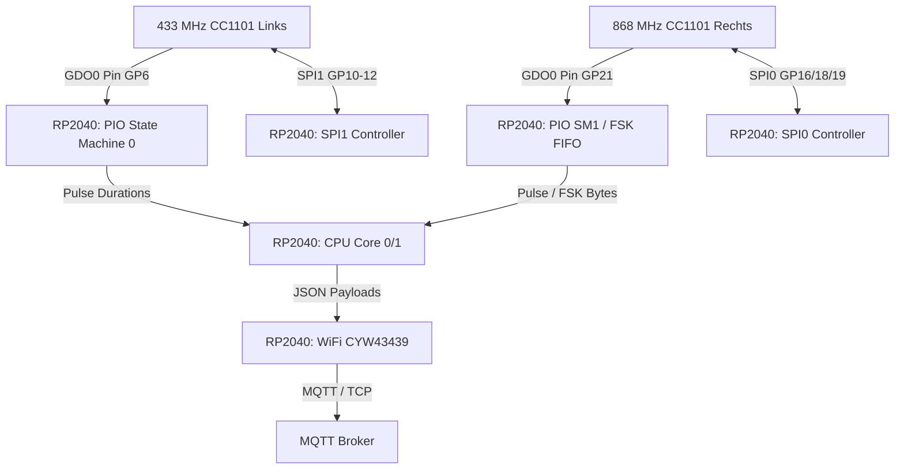
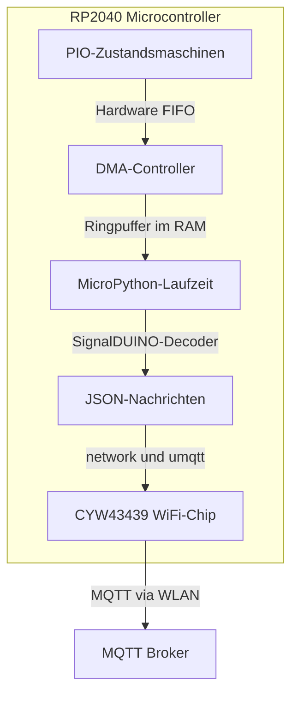

# signalrpi: RF-Empfänger für Smart-Home-Komponenten (433 & 868 MHz)

Dieses Projekt realisiert einen softwarebasierten Funkempfänger für die Frequenzbänder **433 MHz** (LPD-Band) und **868 MHz** (SRD-Band) (im Kontext oft als 443 und 886 MHz referenziert). Die Hardware-Basis bildet ein **RP2040**-Microcontroller (z. B. Raspberry Pi Pico oder Pico W), an den zwei **CC1101**-Transceiver-Module direkt über SPI angebunden sind. Die Dekodierungslogik wird aus dem Open-Source-Projekt **SignalDUINO** portiert. Die dekodierten Daten oder Pulse werden über ein strukturiertes **MQTT-Protokoll** zur weiteren Verarbeitung bereitgestellt.

---

## 1. Systemarchitektur & Hardware-Topologie

Die zeitkritische Erfassung der Signalflanken (im Bereich von $100\,\mu\text{s}$ bis $1000\,\mu\text{s}$) wird direkt auf dem RP2040-Microcontroller ausgeführt. Durch die Nutzung der programmierbaren I/O-Blöcke (**PIO**) des RP2040 können die Puls- und Pausendauern deterministisch und jitterfrei erfasst werden, ohne die CPU-Kerne zu belasten.


```mermaid
graph TD
    RF433[433 MHz CC1101 Links] -->|GDO0 Pin GP6| PIO0[RP2040: PIO State Machine 0]
    RF868[868 MHz CC1101 Rechts] -->|GDO0 Pin GP21| PIO1[RP2040: PIO SM1 / FSK FIFO]
    
    RF433 <-->|SPI1 GP10-12| SPI1[RP2040: SPI1 Controller]
    RF868 <-->|SPI0 GP16/18/19| SPI0[RP2040: SPI0 Controller]
    
    PIO0 -->|Pulse Durations| CPU[RP2040: CPU Core 0/1]
    PIO1 -->|Pulse / FSK Bytes| CPU
    
    CPU -->|JSON Payloads| Comm[RP2040: WiFi CYW43439]
    Comm -->|MQTT / TCP| Broker[MQTT Broker]
```
 
### 1.1 Pin-Belegung (RP2040 zu 2× CC1101 via getrennte SPI-Busse)

Die beiden CC1101-Module nutzen zwei **getrennte Hardware-SPI-Controller** des RP2040 (SPI1 auf der linken Pinleiste, SPI0 auf der rechten Pinleiste). Dadurch werden Buskollisionen und kapazitive Lasten auf den Leitungen vermieden.

#### Modul 1: 433 MHz Transceiver (Links, SPI1)
| CC1101 Funktion | Aderfarbe | RP2040 Pin (physisch) | RP2040 GPIO | Beschreibung |
| :--- | :--- | :--- | :--- | :--- |
| **VCC** | **Rot (rt)** | **Pin 36** | `3V3(OUT)` | Spannungsversorgung (3.3 V) |
| **GND** | **Braun (bn)** | **Pin 13** (oder 18) | `GND` | Masse |
| **SCK** | **Gelb (ge)** | **Pin 14** | `GP10 (SPI1 SCK)` | SPI Clock |
| **MOSI (SI)** | **Orange (or)** | **Pin 15** | `GP11 (SPI1 TX)` | SPI Data In (Modul) / Out (Pico) |
| **MISO (SO)** | **Grün (gn)** | **Pin 16** | `GP12 (SPI1 RX)` | SPI Data Out (Modul) / In (Pico) |
| **CSn** | **Lila (li)** | **Pin 17** | `GP13` | Chip Select Modul 1 |
| **GDO0** | **Blau (bl)** | **Pin 9** | `GP6` | Demoduliertes Signal (PIO SM0 Flankenerkennung) |
| *(GDO2)* | *(Grau/frei)* | **Pin 10** | `GP7` | Optional / Reserve |

#### Modul 2: 868 MHz Transceiver (Rechts, SPI0)
| CC1101 Funktion | Aderfarbe | RP2040 Pin (physisch) | RP2040 GPIO | Beschreibung |
| :--- | :--- | :--- | :--- | :--- |
| **VCC** | **Rot (rt)** | **Pin 36** | `3V3(OUT)` | Spannungsversorgung (3.3 V) |
| **GND** | **Braun (bn)** | **Pin 23** (oder 28/38) | `GND` | Masse |
| **MISO (SO)** | **Grün (gn)** | **Pin 21** | `GP16 (SPI0 RX)` | SPI Data Out (Modul) / In (Pico) |
| **CSn** | **Lila (li)** | **Pin 22** | `GP17` | Chip Select Modul 2 |
| **SCK** | **Gelb (ge)** | **Pin 24** | `GP18 (SPI0 SCK)` | SPI Clock |
| **MOSI (SI)** | **Orange (or)** | **Pin 25** | `GP19 (SPI0 TX)` | SPI Data In (Modul) / Out (Pico) |
| **GDO0** | **Blau (bl)** | **Pin 27** | `GP21` | Signal/Sync (PIO SM1 bei OOK oder FSK-Trigger) |
| *(GDO2)* | *(Grau/frei)* | **Pin 26** | `GP20` | Optional / Reserve |

#### Einheitliche Kabelfarbkodierung (beide Stränge)
* **VCC:** Rot (`rt`)
* **GND:** Braun (`bn`)
* **MOSI (SI):** Orange (`or`)
* **SCLK:** Gelb (`ge`)
* **MISO (SO):** Grün (`gn`)
* **GDO0:** Blau (`bl`)
* **CSn:** Lila (`li`)

#### Pufferkondensator-Konzept (bei ca. 15 cm Leitungslänge)
* **Zentraler Puffer:** $1\times 100\,\mu\text{F}$ Elektrolytkondensator direkt am Pico W zwischen `3V3(OUT)` (Pin 36) und `GND`.
* **Lokale HF-Entkopplung:** Je $1\times 10\,\mu\text{F}$ Keramikkondensator (MLCC X7R/X5R) direkt an den VCC/GND-Pins der beiden CC1101-Module am Leitungsende.

---

## 2. Frequenzbänder und HF-Modulation

Die Sensoren und Aktoren im Heimautomatisierungsbereich nutzen primär folgende Spezifikationen:

| Parameter | 433 MHz Band | 868 MHz Band |
| :--- | :--- | :--- |
| **Effektive Frequenz** | ~433.92 MHz | ~868.30 MHz |
| **Modulation** | ASK / OOK (Amplitude Shift Keying / On-Off Keying) | ASK / OOK oder FSK (Frequency Shift Keying) |
| **Typische Geräte** | Intertechno, Baumarkt-Steckdosen, Wettersensoren | MAX!, LaCrosse, HomeMatic, EQ3 |
| **Hardware-Modul** | CC1101 (konfiguriert für 433 MHz) | CC1101 (konfiguriert für 868 MHz) |

---

## 3. Funktionale Komponentenbeschreibung

Das System ist funktional in drei getrennte, sequenzielle Verarbeitungsschritte unterteilt, um eine saubere Trennung zwischen Hardware-nahem Signalempfang, logischer Dekodierung und der Verteilung der Daten zu gewährleisten.


```mermaid
graph LR
    CC1101[CC1101 Transceiver] -->|Demoduliertes Signal| Comp1[1. Signalempfang & Flankenerkennung]
    Comp1 -->|Puls-Pausen-Folge in µs| Comp2[2. Protokolldekodierung]
    Comp2 -->|Strukturierte Sensordaten| Comp3[3. MQTT-Dispatcher]
    Comp3 -->|JSON via TCP/IP| Broker[MQTT Broker]
```

---

### 3.1 Komponente 1: Empfang & Flankenerkennung (Hardware-nahe Ebene)

Diese Komponente läuft direkt auf dem **RP2040-Microcontroller**. Ihre Hauptaufgabe ist die zeitlich hochpräzise Erfassung der Phasenwechsel des demodulierten Signals am CC1101 GDO0-Pin.

#### 1. Signal-Akquisition & Demodulation (CC1101)
*   Das CC1101-Modul wird über SPI so konfiguriert, dass es das HF-Signal demoduliert (ASK/OOK oder FSK) und das binäre Basisbandsignal (High/Low) auf den GDO0-Pin legt.
*   Es erfolgt keine hardwareseitige Paketfilterung; es wird der rohe Bitstream (einschließlich Rauschen im Äther) ausgegeben.

#### 2. Jitterfreie Flankenerkennung mittels PIO (Programmable I/O)
*   Ein PIO-Programm überwacht den GPIO-Pin des GDO0-Eingangs in einer Schleife mit konstanter Taktrate (z. B. 1 MHz für eine Auflösung von $1\,\mu\text{s}$).
*   **Ablauf im PIO-Zustandsautomaten:**
    1. Warte auf Zustandsänderung (Flanke) am Pin.
    2. Wenn Flanke auftritt: Übertrage den aktuellen Zählerstand (Dauer der vorherigen Phase in $\mu\text{s}$) in die RX-FIFO des RP2040.
    3. Setze den internen Zähler zurück und beginne mit der Messung der nächsten Phase.
*   **Vorteil:** Dieses Verfahren ist deterministisch und unabhängig vom CPU-Scheduling oder Interrupt-Latenzen des Microcontrollers.

#### 3. Rauschunterdrückung & Paketabgrenzung (Software-Filterung)
*   **Glitch-Filter:** Phasen, die kürzer als eine minimale Pulsdauer sind (z. B. $< 50\,\mu\text{s}$), werden als Rauschen verworfen.
*   **Paketabgrenzung (Inter-Packet Gap):** Wenn der Pin für eine definierte Zeit (z. B. $> 5000\,\mu\text{s}$) auf einem konstanten Pegel (meist Low/Pause) bleibt, wird dies als Ende eines Datenpakets interpretiert. Die bis dahin gesammelte Puls-Pausen-Folge (ein Array aus ganzzahligen Werten in $\mu\text{s}$) wird zur Dekodierung freigegeben.

---

### 3.2 Komponente 2: Dekodierung der Signalfolgen (Logik-Ebene)

Diese Komponente nimmt die rohe Puls-Pausen-Folge entgegen und wandelt sie in ein logisches Bit-Muster um, welches anschließend physikalisch interpretiert wird.

#### 1. Protokoll-Matching & Toleranzabgleich
Die empfangene Signalfolge wird mit einer Datenbank bekannter RF-Protokolle (basierend auf den SignalDUINO-Modulen) abgeglichen. Jedes Protokoll ist durch feste Kenngrößen definiert:
*   **Sync-Puls-Muster:** Ein langes Startbit gefolgt von einer langen Pause zur Synchronisation (z. B. Sync-Puls von $9000\,\mu\text{s}$ High und $4500\,\mu\text{s}$ Low).
*   **Bit-Codierung:**
    *   *Pulsweitenmodulation (PWM):* Logisch 0 = kurzer Puls + lange Pause; Logisch 1 = langer Puls + kurze Pause.
    *   *Manchester-Codierung / Bi-Phase:* Die Information liegt im Phasenübergang (steigende vs. fallende Flanke in der Mitte des Bit-Intervalls).
*   **Toleranzband:** Da Bauteiltoleranzen und Signalrauschen die Pulsbreiten verändern, wird beim Vergleich ein Toleranzfenster von typischerweise $\pm 10\%$ bis $\pm 20\%$ auf die Sollzeiten angewendet.

#### 2. Bitstream-Rekonstruktion & Validierung
*   Wurde ein passendes Protokoll identifiziert, wird die Pulsfolge in ein Array aus Bytes umgewandelt.
*   **Integritätsprüfung:** Um Fehldekodierungen durch Rauschen zu verhindern, werden protokollspezifische Prüfverfahren angewendet:
    *   Verifikation der erwarteten Bit-Länge des Protokolls (z. B. exakt 36 Bits für bestimmte Wettersensoren).
    *   Berechnung und Abgleich von Paritätsbits, Prüfsummen (Checksummen) oder zyklischen Redundanzprüfungen (CRC).

#### 3. Physikalische Datenextraktion und Definition des Sensortyps
Die Festlegung, um welchen **Sensortyp** (Temperatur, Feuchte, Regen, Wind, Taster etc.) es sich handelt, erfolgt fest codiert auf Ebene der **Protokolldekoder (Komponente 2)**. 

*   **Protokoll-ID als primärer Schlüssel:** Jedes empfangene und erfolgreich validierte Bitmuster wird einem spezifischen Protokoll (z. B. `SD_WS07` oder `TX3`) zugeordnet.
*   **Bit-Mapping-Tabelle (Parser-Definition):** Im Quellcode des entsprechenden Dekoders ist exakt definiert, welche Bit-Bereiche für welche physikalische Größe stehen.
    *   *Beispiel-Definition im Dekoder (Python):*
        ```python
        # Auszug einer Protokolldefinition
        PROTOCOL_MAP = {
            "SD_WS07": {
                "name": "WeatherStation_WS07",
                "fields": {
                    "temperature": {"start_bit": 12, "length": 12, "type": "float", "factor": 0.1, "signed": True, "unit": "°C"},
                    "humidity":    {"start_bit": 24, "length": 8,  "type": "int",   "factor": 1.0, "signed": False, "unit": "%"},
                    "battery_low": {"start_bit": 32, "length": 1,  "type": "bool",  "unit": None}
                }
            },
            "SD_WS_Rain": {
                "name": "RainGauge_WS",
                "fields": {
                    "rain_total":  {"start_bit": 16, "length": 16, "type": "float", "factor": 0.3, "signed": False, "unit": "mm"}
                }
            }
        }
        ```
*   **Dynamische Typisierung:** Das System weiß durch diesen Abgleich automatisch, ob ein Sensor Temperatur-, Feuchtigkeits-, Regen- oder Winddaten liefert. Es werden nur die Felder extrahiert und im JSON-Objekt bereitgestellt, die laut Protokolldefinition existieren.

---

### 3.3 Komponente 3: MQTT-Dispatcher & Gateway (Verteilungs-Ebene)

Diese Komponente bereitet die physikalischen Daten für die Heimautomatisierung auf und sorgt für den zuverlässigen Transport über das Netzwerk.

#### 1. Payload-Strukturierung (JSON)
Die extrahierten Werte werden in eine standardisierte, maschinenlesbare JSON-Struktur überführt. Neben den Nutzdaten werden Metadaten (Zeitstempel, Signalstärke RSSI, Protokollname) angehängt, um eine lückenlose Diagnose zu ermöglichen.

#### 2. Topic-Struktur & Publish-Strategie
Die Topics sind hierarchisch aufgebaut, um eine einfache Filterung im MQTT-Broker (z. B. durch Wildcards) zu ermöglichen:
*   **Statustopic:** `signalrpi/status` (LWT - Last Will and Testament zur Verbindungsüberwachung)
*   **Raw-Topic (Debugging):** `signalrpi/raw` (Übertragung von Roh-Pulsdaten bei unbekannten Protokollen)
*   **Datentopic:** `signalrpi/messages/<protocol>/<device_id>`

#### 3. JSON-Payload-Spezifikation (Beispiel Wettersensor - Protokoll SD_WS07)
**Topic:** `signalrpi/messages/SD_WS07/sensor_ch1`
```json
{
  "timestamp": "2026-06-24T16:22:04Z",
  "protocol": "SD_WS07",
  "device_id": "sensor_ch1",
  "data": {
    "temperature": 21.4,
    "humidity": 55.0,
    "battery_low": false
  },
  "signal": {
    "rssi": -72.0,
    "pulses": 36
  }
}
```

---

## 4. Software-Laufzeitumgebung (Entscheidung: MicroPython)

Für dieses Projekt wurde **MicroPython** als primäre Laufzeitumgebung auf dem **Raspberry Pi Pico W** ausgewählt.

### Architektur der Laufzeitumgebung


```mermaid
graph TD
    subgraph rp2040 ["RP2040 Microcontroller"]
        PIO[PIO-Zustandsmaschinen] -->|Hardware FIFO| DMA[DMA-Controller]
        DMA -->|Ringpuffer im RAM| MP[MicroPython-Laufzeit]
        MP -->|SignalDUINO-Decoder| JSON[JSON-Nachrichten]
        JSON -->|network und umqtt| WiFi[CYW43439 WiFi-Chip]
    end
    WiFi -->|MQTT via WLAN| Broker[MQTT Broker]
```

### Begründung und Funktionsweise der Arbeitsteilung:

1. **Echtzeit-Garantie über Hardware (PIO + DMA)**: 
   Die extrem zeitkritische Abtastung der Puls-Pausen-Dauern am GDO0-Pin wird vollständig in Hardware auf dem RP2040 gelöst. Die **PIO-Zustandsautomaten** messen Flankenabstände mit einer Genauigkeit von $1\,\mu\text{s}$ und schieben die Werte in eine FIFO-Queue. Ein **DMA-Kanal** schreibt diese Daten im Hintergrund direkt in einen RAM-Ringpuffer.
2. **Entkopplung vom Python-Interpreter**: 
   Da die Signal-Akquisition auf Hardware-Ebene läuft, haben eventuelle Blockaden durch die MicroPython-Laufzeitumgebung (wie z. B. Garbage Collector-Läufe oder WLAN-Sendezyklen) **keinen Einfluss** auf die Genauigkeit der Signalaufnahme. Der Ringpuffer dient als Stoßdämpfer.
3. **Effiziente Entwicklung**: 
   WLAN-Verbindung und MQTT-Publishing lassen sich in MicroPython mit sehr geringem Overhead über Standard-Bibliotheken realisieren. Die Portierung der komplexen SignalDUINO-Dekoderlogik (Perl) in lesbaren und wartbaren Python-Code beschleunigt das Projekt erheblich.

---

## 5. Geplanter Implementierungs-Workflow

| Phase | Bezeichnung | Fokus-Bereiche / Aufgaben | Status |
| :--- | :--- | :--- | :--- |
| **Phase 1** | **Firmware & PIO** | - Implementierung der PIO-State-Machines zur Flankenerkennung<br>- SPI-Treiber-Initialisierung und Register-Konfiguration der CC1101-Module | **Abgeschlossen** |
| **Phase 2** | **Logik-Portierung** | - Parser für SignalDUINO-Telegramme (Roh-Pulsfolgen)<br>- Portierung der Protokoll-Decoder (FHEM Perl $\rightarrow$ Python/C++) | **Abgeschlossen** |
| **Phase 3** | **MQTT & Netzwerk** | - WLAN-Kopplung (Pico W) oder USB-Serial-Kommunikation<br>- MQTT-Client-Implementierung und JSON-Serialisierung der Nachrichten | **Abgeschlossen** |
| **Phase 4** | **Validierung** | - Integrationstests mit realen 433 MHz und 868 MHz HF-Sendern<br>- Reichweiten- und Sensitivitätsoptimierung | **Abgeschlossen (Offline)** |

### Fortlaufende Aufgaben & offene Punkte:
- [x] Auswahl der Software-Plattform: **MicroPython** auf **Raspberry Pi Pico W**.
- [x] Auswahl der primären Zielprotokolle (TFA/NC_WS, Intertechno, Bodenfeuchte/Regen-Sensoren).
- [x] Definition der CC1101-Initialisierungs-Register für OOK (433.92 MHz) und FSK-Paketmodus (868.30 MHz).

---

## 6. Entwicklungs-Workflow & Test-Setup

Dieses Kapitel beschreibt, wie neue Software auf den Pico W übertragen wird und wie das Test-Setup (sowohl Hardware als auch Software-Simulation) aufgebaut ist.

### 6.1 Code-Deployment (Flashen der Skripte)

Die Skripte im Verzeichnis `src/` werden direkt auf das Flash-Dateisystem des Raspberry Pi Pico W übertragen.

*   **VS Code + "MicroPico"-Extension (Empfohlen):**
    1. Pico W per USB-Kabel mit dem PC verbinden.
    2. In VS Code den Befehl `MicroPico: Upload Project` ausführen.
    3. Über den Button "Terminal" (unten in VS Code) direkt auf die interaktive Python-Konsole (REPL) zugreifen.
*   **Kommandozeile (mpremote):**
    *   Installation via `pip install mpremote`.
    *   Dateien hochladen:
        ```bash
        mremote fs cp src/main.py :main.py
        mremote fs cp -r src/decoders :decoders
        ```
    *   Konsole öffnen: `mpremote repl`

### 6.2 Hardware-Testaufbau & Sicherheitshinweise

Die beiden CC1101-Module werden direkt über den SPI0-Bus an den Pico W angeschlossen (siehe Belegungsplan in Kapitel 1.1).

*   **Sicherheitsregel (Antennen):** Betreibe die CC1101-Module **niemals** ohne angeschlossene Antenne. Andernfalls kann die reflektierte Sendeleistung die HF-Endstufen der Module zerstören.
    *   *433 MHz Antenne:* Drahtlänge ca. $17{,}3\,\text{cm}$ ($\lambda/4$).
    *   *868 MHz Antenne:* Drahtlänge ca. $8{,}6\,\text{cm}$ ($\lambda/4$).
*   **Spannungspegel:** Die CC1101-Module müssen mit **3.3 V** (VCC an `3V3(OUT)`) betrieben werden. Der RP2040 ist nicht 5V-tolerant.

### 6.3 Test- und Debugging-Szenarien

1.  **Decoder-Simulation (PC-basiert):**
    Die Portierung der SignalDUINO-Decoder (Perl $\rightarrow$ Python) kann vollständig offline auf dem PC getestet werden. Dazu werden aufgezeichnete Pulsfolgen (als ganzzahlige Arrays in $\mu\text{s}$) an ein Testskript auf dem PC übergeben.
2.  **Raw-Sniffing (Pico am PC):**
    Über die USB-Serial-Konsole (REPL) kann der Pico W im Sniffer-Modus betrieben werden, um unbekannte RF-Signale abzufangen und deren Pulsfolgen live im Terminal auszugeben.
3.  **End-to-End-Test:**
    Der Pico W verbindet sich autonom mit dem WLAN und sendet JSON-Telegramme an den MQTT-Broker. Zur Live-Validierung der MQTT-Payloads wird die Verwendung von **MQTT Explorer** auf dem PC empfohlen.

### 6.4 Konfiguration des 868 MHz-Empfängers

Da im 868 MHz-Band sowohl FSK-modulierte Sensoren (z. B. modernere Fine Offset/Ecowitt-Sensoren) als auch ASK/OOK-modulierte Sensoren (z. B. ältere FS20- oder MAX!-Komponenten) arbeiten, kann der Betriebsmodus für den zweiten CC1101-Transceiver in der Datei [config_local.py](file:///c:/Users/Norma/Documents/antigravity/signalrpi/src/config_local.py) konfiguriert werden:

```python
# CC1101 868 MHz Betriebsmodus
# - "FSK" : (Standard) Nutzt den CC1101-Hardware-Packet-Handler zur robusten Erfassung
#           und Filterung von FSK-Paketen (z. B. WH51, WH40).
# - "OOK" : Schaltet den Transceiver in den asynchronen Modus (Flankenerkennung per PIO),
#           um rohe ASK/OOK-Pulsfolgen wie bei 433 MHz zu erfassen.
MODE_868 = "FSK"
```

*   **Verhalten bei `"FSK"`:**
    *   Der CC1101 filtert das Signal hardwareseitig auf das Sync-Word `0x2DD4`.
    *   Valide Pakete werden per SPI-FIFO gelesen und an [decode_fsk_packet](file:///c:/Users/Norma/Documents/antigravity/signalrpi/src/decoders/__init__.py#L32) übergeben.
    *   Es wird keine PIO-State-Machine für diesen Empfänger belegt (Ressourceneinsparung auf dem RP2040).
*   **Verhalten bei `"OOK"`:**
    *   Der CC1101 leitet das unstrukturierte Basisbandsignal an Pin GP21 weiter.
    *   Die **PIO State Machine 1** wird gestartet, um die Impuls- und Pausendauern zu messen.
    *   Die resultierenden Pulsfolgen werden an [decode_signal](file:///c:/Users/Norma/Documents/antigravity/signalrpi/src/decoders/__init__.py#L46) (identisch zum 433 MHz-Pfad) übergeben.

---

## 7. Decoder-Spezifikation & Unterstützte Protokolle

Um die Kompatibilität mit Deiner bestehenden FHEM-Installation sicherzustellen, wurden die folgenden Decoder implementiert und integriert.

### 7.1 CUL_TCM97001 (TFA / NC_WS Klimasensoren)
*   **HF-Parameter:** Frequenz 433.92 MHz, Modulation ASK/OOK.
*   **Beschreibung:** Dieser Decoder übersetzt Signale von Temperatur- und Luftfeuchtigkeitssensoren (z. B. TFA Thermo-Hygrometer oder PEARL NC7159).
*   **Telegramm-Format:** 36-Bit PWM (Pulse-Width Modulation).
    *   *Puls-Timing:*
        *   **Sync:** ca. $500\,\mu\text{s}$ High + $9000\,\mu\text{s}$ Low.
        *   **Logisch 0:** ca. $500\,\mu\text{s}$ High + $2000\,\mu\text{s}$ Low.
        *   **Logisch 1:** ca. $500\,\mu\text{s}$ High + $4000\,\mu\text{s}$ Low.
    *   *Dekodierungslogik:* 
        *   Extrahiert die 12-Bit-Temperatur (Bits 16-27), wobei negative Werte im Zweierkomplement berechnet werden.
        *   Extrahiert die 7-Bit-Luftfeuchtigkeit (Bits 29-35), den Kanal (Bits 14-15), den Batteriestatus (Low = `0`, OK = `1`) und den Sendemodus.
        *   Die Geräte-ID in FHEM entspricht dem dezimalen Wert des ersten Bytes (z. B. `0x50` -> ID `80`).
*   **MQTT-Topic:** `signalrpi/messages/CUL_TCM97001/<device_id>`
*   **JSON-Payload:**
    ```json
    {
      "temperature": 21.4,
      "humidity": 55.0,
      "battery_low": false,
      "channel": 3,
      "forced_send": false
    }
    ```

### 7.2 Intertechno (IT - Funkaktoren & Fernbedienungen)
*   **HF-Parameter:** Frequenz 433.92 MHz, Modulation ASK/OOK.
*   **Beschreibung:** Steuert Funksteckdosen, Jalousien-Aktoren und empfängt Signale von Wandschaltern.
*   **Telegramm-Format:** Tri-State oder feste Puls-Pausen-Verhältnisse (12 oder 26 Bits).
    *   *Puls-Timing:* Typisch $350\,\mu\text{s}$ High / $1050\,\mu\text{s}$ Low (Logisch 0) bzw. $1050\,\mu\text{s}$ High / $350\,\mu\text{s}$ Low (Logisch 1).
*   **MQTT-Topic:** `signalrpi/messages/IT/<device_id>`
*   **JSON-Payload:**
    ```json
    {
      "state": "on",     // oder "off"
      "group": "0",
      "channel": "0001"
    }
    ```

### 7.3 SD_WS (SignalDUINO Wettersensoren)
Dieser Decoder fasst verschiedene Wettersensoren (Bodenfeuchte und Regen) zusammen, die über das SignalDUINO-Framework empfangen werden.

#### SD_WS_50 (Bodenfeuchtesensoren / Opus XT300)
*   **HF-Parameter:** Frequenz 433.92 MHz, ASK/OOK (Pulsweiten-Modulation).
*   **Puls-Timing:**
    *   **Logisch 0:** ca. $1500\,\mu\text{s}$ High + $1000\,\mu\text{s}$ Low.
    *   **Logisch 1:** ca. $500\,\mu\text{s}$ High + $1000\,\mu\text{s}$ Low.
    *   **Paketlänge:** 48 Bits (6 Bytes), Preamble stets `0xFF`.
*   **Prüfsumme:** Summe der Bytes 1 bis 4 modulo 256 entspricht Byte 5.
*   **MQTT-Topic:** `signalrpi/messages/SD_WS_50/SM_<sensor_id>` (z. B. `SM_1`)
*   **JSON-Payload:** `{"moisture": 45.0, "temperature": 23.5}`

#### SD_WS_107 (Eurochron Bodenfeuchtesensoren / Fine Offset WH51)
*   **HF-Parameter:** Frequenz 868.30 MHz, Modulation 2-FSK (Paketmodus).
*   **Hardware-Empfang:** CC1101 synchronisiert auf das Sync-Word `2DD4`, filtert nach Paketlänge (14 Bytes Payload) und reicht die Bytes per SPI weiter.
*   **Validierung:** 
    *   Prüft auf Family-Code `0x51`.
    *   Prüft CRC8 (Polynom `0x31`, Startwert `0x00`) über Byte 0-11 gegen Byte 12.
    *   Prüft Sum-8 Checksumme über Byte 0-12 gegen Byte 13.
*   **MQTT-Topic:** `signalrpi/messages/SD_WS_107/<device_id>` (z. B. `0D32C1`)
*   **JSON-Payload:** `{"moisture": 62.0, "battery_voltage": 1.6, "battery_low": false, "adc": 199}`

#### SD_WS_126 (Bresser/Ecowitt Regensensor WH40)
*   **HF-Parameter:** Frequenz 868.30 MHz, Modulation 2-FSK (Paketmodus).
*   **Hardware-Empfang:** CC1101 synchronisiert auf das Sync-Word `2DD4`, filtert nach Paketlänge (14 Bytes Payload).
*   **Validierung:**
    *   Prüft auf Family-Code `0x40`.
    *   Prüft CRC8 (Polynom `0x31`, Startwert `0x00`) über Byte 0-6 gegen Byte 7.
    *   Prüft Sum-8 Checksumme über Byte 0-7 gegen Byte 8.
*   **MQTT-Topic:** `signalrpi/messages/SD_WS_126/<device_id>` (z. B. `011CDF`)
*   **JSON-Payload:** `{"rain_total": 12.3, "rain_ticks": 123, "battery_voltage": 1.5, "battery_low": false}`


