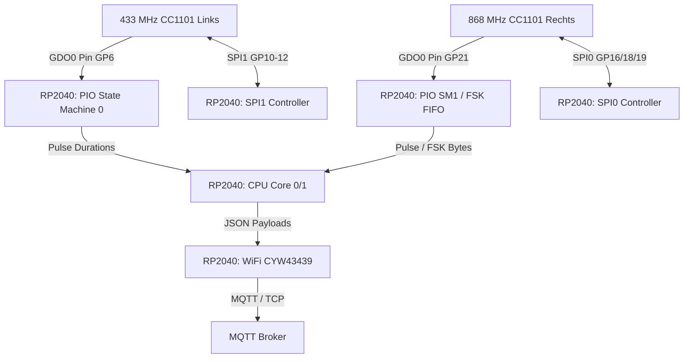
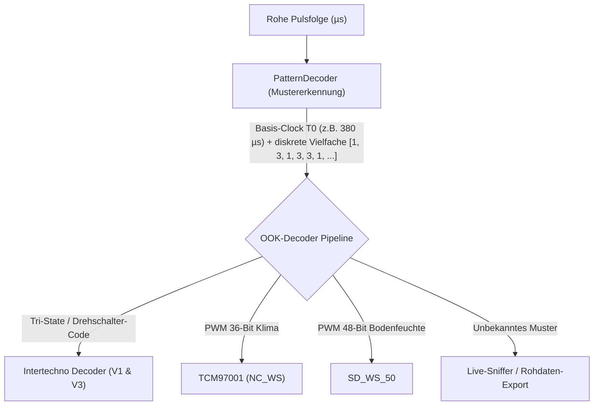
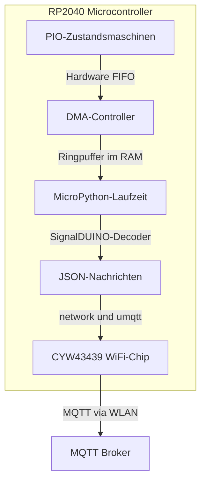

# signalrpi: RF-Empfänger für Smart-Home-Komponenten (433 & 868 MHz)

Dieses Projekt realisiert einen softwarebasierten Funkempfänger für die Frequenzbänder **433 MHz** (LPD-Band) und **868 MHz** (SRD-Band) (im Kontext oft als 443 und 886 MHz referenziert). Die Hardware-Basis bildet ein **RP2040**-Microcontroller (z. B. Raspberry Pi Pico oder Pico W), an den zwei **CC1101**-Transceiver-Module direkt über SPI angebunden sind. Die Dekodierungslogik wird aus dem Open-Source-Projekt **SignalDUINO** portiert. Die dekodierten Daten oder Pulse werden über ein strukturiertes **MQTT-Protokoll** zur weiteren Verarbeitung bereitgestellt.

---

## 1. Systemarchitektur & Hardware-Topologie

Die zeitkritische Erfassung der Signalflanken (im Bereich von $100\,\mu\text{s}$ bis $1000\,\mu\text{s}$) wird direkt auf dem RP2040-Microcontroller ausgeführt. Durch die Nutzung der programmierbaren I/O-Blöcke (**PIO**) des RP2040 können die Puls- und Pausendauern deterministisch und jitterfrei erfasst werden, ohne die CPU-Kerne zu belasten.


```mermaid
graph TD
    RF433[433 MHz CC1101 Links] -->|GDO0 Pin GP6| PIO0[RP2040: PIO State Machine 0]
    RF868[868 MHz CC1101 Rechts] -->|GDO0 Pin GP21| PIO1[RP2040: PIO SM1 / FSK FIFO]
    
    RF433 <-->|SPI1 GP10-12| SPI1[RP2040: SPI1 Controller]
    RF868 <-->|SPI0 GP16/18/19| SPI0[RP2040: SPI0 Controller]
    
    PIO0 -->|Pulse Durations| CPU[RP2040: CPU Core 0/1]
    PIO1 -->|Pulse / FSK Bytes| CPU
    
    CPU -->|JSON Payloads| Comm[RP2040: WiFi CYW43439]
    Comm -->|MQTT / TCP| Broker[MQTT Broker]
```
 
### 1.1 Pin-Belegung (RP2040 zu 2× CC1101 via getrennten SPI-Bussen)

Die beiden CC1101-Module nutzen zwei **getrennte Hardware-SPI-Controller** des RP2040 (SPI1 auf der linken Pinleiste, SPI0 auf der rechten Pinleiste). Dadurch werden Buskollisionen und kapazitive Lasten auf den Leitungen vermieden.

#### Modul 1: 433 MHz Transceiver (Links, SPI1)
| CC1101 Funktion | Aderfarbe | RP2040 Pin (physisch) | RP2040 GPIO | Beschreibung |
| :--- | :--- | :--- | :--- | :--- |
| **VCC** | **Rot (rt)** | **Pin 36** | `3V3(OUT)` | Spannungsversorgung (3.3 V) |
| **GND** | **Braun (bn)** | **Pin 13** (oder 18) | `GND` | Masse |
| **SCK** | **Gelb (ge)** | **Pin 14** | `GP10 (SPI1 SCK)` | SPI Clock |
| **MOSI (SI)** | **Orange (or)** | **Pin 15** | `GP11 (SPI1 TX)` | SPI Data In (Modul) / Out (Pico) |
| **MISO (SO)** | **Grün (gn)** | **Pin 16** | `GP12 (SPI1 RX)` | SPI Data Out (Modul) / In (Pico) |
| **CSn** | **Lila (li)** | **Pin 17** | `GP13` | Chip Select Modul 1 |
| **GDO0** | **Blau (bl)** | **Pin 9** | `GP6` | Demoduliertes Signal (PIO SM0 Flankenerkennung) |
| *(GDO2)* | *(Grau/frei)* | **Pin 10** | `GP7` | Optional / Reserve |

#### Modul 2: 868 MHz Transceiver (Rechts, SPI0)
| CC1101 Funktion | Aderfarbe | RP2040 Pin (physisch) | RP2040 GPIO | Beschreibung |
| :--- | :--- | :--- | :--- | :--- |
| **VCC** | **Rot (rt)** | **Pin 36** | `3V3(OUT)` | Spannungsversorgung (3.3 V) |
| **GND** | **Braun (bn)** | **Pin 23** (oder 28/38) | `GND` | Masse |
| **MISO (SO)** | **Grün (gn)** | **Pin 21** | `GP16 (SPI0 RX)` | SPI Data Out (Modul) / In (Pico) |
| **CSn** | **Lila (li)** | **Pin 22** | `GP17` | Chip Select Modul 2 |
| **SCK** | **Gelb (ge)** | **Pin 24** | `GP18 (SPI0 SCK)` | SPI Clock |
| **MOSI (SI)** | **Orange (or)** | **Pin 25** | `GP19 (SPI0 TX)` | SPI Data In (Modul) / Out (Pico) |
| **GDO0** | **Blau (bl)** | **Pin 27** | `GP21` | Signal/Sync (PIO SM1 bei OOK oder FSK-Trigger) |
| *(GDO2)* | *(Grau/frei)* | **Pin 26** | `GP20` | Optional / Reserve |

#### Einheitliche Kabelfarbkodierung (beide Stränge)
* **VCC:** Rot (`rt`)
* **GND:** Braun (`bn`)
* **MOSI (SI):** Orange (`or`)
* **SCLK:** Gelb (`ge`)
* **MISO (SO):** Grün (`gn`)
* **GDO0:** Blau (`bl`)
* **CSn:** Lila (`li`)

#### Pufferkondensator-Konzept (bei ca. 15 cm Leitungslänge)
* **Zentraler Puffer:** $1\times 100\,\mu\text{F}$ Elektrolytkondensator direkt am Pico W zwischen `3V3(OUT)` (Pin 36) und `GND`.
* **Lokale HF-Entkopplung:** Je $1\times 10\,\mu\text{F}$ Keramikkondensator (MLCC X7R/X5R) direkt an den VCC/GND-Pins der beiden CC1101-Module am Leitungsende.

---

## 2. Frequenzbänder und HF-Modulation

Die Sensoren und Aktoren im Heimautomatisierungsbereich nutzen primär folgende Spezifikationen:

| Parameter | 433 MHz Band | 868 MHz Band |
| :--- | :--- | :--- |
| **Effektive Frequenz** | ~433.92 MHz | ~868.30 MHz |
| **Modulation** | ASK / OOK (Amplitude Shift Keying / On-Off Keying) | ASK / OOK oder FSK (Frequency Shift Keying) |
| **Typische Geräte** | Intertechno, Baumarkt-Steckdosen, Wettersensoren | MAX!, LaCrosse, HomeMatic, EQ3 |
| **Hardware-Modul** | CC1101 (konfiguriert für 433 MHz) | CC1101 (konfiguriert für 868 MHz) |

---

## 3. Funktionale Komponentenbeschreibung

Das System ist funktional in drei getrennte, sequenzielle Verarbeitungsschritte unterteilt, um eine saubere Trennung zwischen Hardware-nahem Signalempfang, logischer Dekodierung und der Verteilung der Daten zu gewährleisten.


```mermaid
graph LR
    CC1101[CC1101 Transceiver] -->|Demoduliertes Signal| Comp1[1. Signalempfang & Flankenerkennung]
    Comp1 -->|Puls-Pausen-Folge in µs| Comp2[2. Protokolldekodierung]
    Comp2 -->|Strukturierte Sensordaten| Comp3[3. MQTT-Dispatcher]
    Comp3 -->|JSON via TCP/IP| Broker[MQTT Broker]
```

---

### 3.1 Komponente 1: Empfang & Flankenerkennung (Hardware-nahe Ebene)

Diese Komponente läuft direkt auf dem **RP2040-Microcontroller**. Ihre Hauptaufgabe ist die zeitlich hochpräzise Erfassung der Phasenwechsel des demodulierten Signals am CC1101 GDO0-Pin.

#### 1. Signal-Akquisition & Demodulation (CC1101)
*   Das CC1101-Modul wird über SPI so konfiguriert, dass es das HF-Signal demoduliert (ASK/OOK oder FSK) und das binäre Basisbandsignal (High/Low) auf den GDO0-Pin legt.
*   Es erfolgt keine hardwareseitige Paketfilterung; es wird der rohe Bitstream (einschließlich Rauschen im Äther) ausgegeben.

#### 2. Jitterfreie Flankenerkennung mittels PIO (Programmable I/O)
*   Ein PIO-Programm überwacht den GPIO-Pin des GDO0-Eingangs in einer Schleife mit konstanter Taktrate (z. B. 1 MHz für eine Auflösung von $1\,\mu\text{s}$).
*   **Ablauf im PIO-Zustandsautomaten:**
    1. Warte auf Zustandsänderung (Flanke) am Pin.
    2. Wenn Flanke auftritt: Übertrage den aktuellen Zählerstand (Dauer der vorherigen Phase in $\mu\text{s}$) in die RX-FIFO des RP2040.
    3. Setze den internen Zähler zurück und beginne mit der Messung der nächsten Phase.
*   **Vorteil:** Dieses Verfahren ist deterministisch und unabhängig vom CPU-Scheduling oder Interrupt-Latenzen des Microcontrollers.

#### 3. Rauschunterdrückung & Paketabgrenzung (Software-Filterung)
*   **Glitch-Filter:** Phasen, die kürzer als eine minimale Pulsdauer sind (z. B. $< 50\,\mu\text{s}$), werden als Rauschen verworfen.
*   **Paketabgrenzung (Inter-Packet Gap):** Wenn der Pin für eine definierte Zeit (z. B. $> 5000\,\mu\text{s}$) auf einem konstanten Pegel (meist Low/Pause) bleibt, wird dies als Ende eines Datenpakets interpretiert. Die bis dahin gesammelte Puls-Pausen-Folge (ein Array aus ganzzahligen Werten in $\mu\text{s}$) wird zur Dekodierung freigegeben.

---

### 3.2 Komponente 2: Dekodierung der Signalfolgen (Mustererkennung & Protokoll-Parser)

Diese Komponente nimmt die rohe Puls-Pausen-Folge entgegen und wandelt sie in ein logisches Bit-Muster um, welches anschließend physikalisch interpretiert wird. Hierbei kommt die bewährte **SignalDUINO-Mustererkennung (`signalDecoder.cpp`)** zum Einsatz:


```mermaid
flowchart TD
    Raw["Rohe Pulsfolge (µs)"] --> PD["PatternDecoder (Mustererkennung)"]
    PD -->|"Basis-Clock T0 (z.B. 380 µs) + diskrete Vielfache [1, 3, 1, 3, 3, 1, ...]"| Decoders{"OOK-Decoder Pipeline"}
    Decoders -->|"Tri-State / Drehschalter-Code"| IT["Intertechno Decoder (V1 & V3)"]
    Decoders -->|"PWM 36-Bit Klima"| TCM["TCM97001 (NC_WS)"]
    Decoders -->|"PWM 48-Bit Bodenfeuchte"| WS["SD_WS_50"]
    Decoders -->|"Unbekanntes Muster"| Live["Live-Sniffer / Rohdaten-Export"]
```

#### 1. Dynamische Takt- und Vielfachen-Erkennung (`PatternDecoder`)
*   **Clusterung:** Bildet adaptive Cluster ähnlicher Pulslängen mit $\pm 25\%$ Toleranzband.
*   **Basis-Takt ($T_0$ / Clock):** Findet die kürzeste signifikant häufige Pulsdauer (typischerweise $10 - 15\%$ aller Pulse, z. B. $380\,\mu\text{s}$).
*   **Diskrete Vielfache:** Alle Pulse werden als ganzzahlige Vielfache quantisiert: $k_i = \text{round}(P_i / T_0)$. Dadurch sind nachgelagerte Decoder immun gegen Taktjitter und Quarzdriften.

#### 2. Protokoll-Matching & Toleranzabgleich
Die quantisierten Vielfachen werden der Kette registrierter Decoder übergeben:
*   *Tri-State Modulation:* $1T / 3T + 1T / 3T \rightarrow$ `'0'`, $1T / 3T + 3T / 1T \rightarrow$ `'F'`, $3T / 1T + 3T / 1T \rightarrow$ `'1'`, $3T / 1T + 1T / 3T \rightarrow$ `'D'`.
*   *Manchester-Codierung:* Phasenübergänge (z. B. $1T / 1T / 1T / 5T$ vs. $1T / 5T / 1T / 1T$ bei Intertechno V3).
*   *Pulsweitenmodulation (PWM):* Längenverhältnisse von High- und Low-Phasen (z. B. $1T$ High + $4T/8T$ Low bei TCM97001).

---

### 3.3 Komponente 3: MQTT-Dispatcher & Gateway (Verteilungs-Ebene)

Diese Komponente bereitet die physikalischen Daten für die Heimautomatisierung auf und sorgt für den zuverlässigen Transport über das Netzwerk.

#### 1. Payload-Strukturierung (JSON)
Die extrahierten Werte werden in eine standardisierte, maschinenlesbare JSON-Struktur überführt. Neben den Nutzdaten werden Metadaten (Zeitstempel, Signalstärke RSSI, Protokollname) angehängt, um eine lückenlose Diagnose zu ermöglichen.

#### 2. Topic-Struktur & Publish-Strategie
Die Topics sind hierarchisch aufgebaut, um eine einfache Filterung im MQTT-Broker (z. B. durch Wildcards) zu ermöglichen:
*   **Statustopic:** `signalrpi/status` (LWT - Last Will and Testament zur Verbindungsüberwachung)
*   **Raw-Topic (Debugging):** `signalrpi/raw` (Übertragung von Roh-Pulsdaten bei unbekannten Protokollen)
*   **Datentopic:** `signalrpi/messages/<protocol>/<device_id>`

#### 3. JSON-Payload-Spezifikation (Beispiel Wettersensor - Protokoll SD_WS07)
**Topic:** `signalrpi/messages/SD_WS07/sensor_ch1`
```json
{
  "timestamp": "2026-06-24T16:22:04Z",
  "protocol": "SD_WS07",
  "device_id": "sensor_ch1",
  "data": {
    "temperature": 21.4,
    "humidity": 55.0,
    "battery_low": false
  },
  "signal": {
    "rssi": -72.0,
    "pulses": 36
  }
}
```

#### 4. Integration in FHEM (via MQTT2)

FHEM-Benutzer können SignalRPI über das moderne `MQTT2`-Subsystem anbinden. Da SignalRPI standardisierte JSON-Payloads und native Status-Topics verwendet, ist kein eigener SignalDUINO-USB-Stick mehr am FHEM-Host nötig.

##### A. Broker-Verbindung herstellen (FHEM)
Falls FHEM noch nicht mit dem Mosquitto-Broker verbunden ist:
```perl
define myBroker MQTT2_CLIENT 192.168.125.4:1883
attr myBroker clientId fhem_signalrpi
attr myBroker keepalive 60
attr myBroker autocreate simple
```

##### B. Eingerichteten Sensor einbinden (`MQTT2_DEVICE`)
SignalRPI sendet Sensordaten zyklisch auf `signalrpi/devices/<ha_id>/state`. Über die FHEM-Funktion `json2nameValue($EVENT)` werden die JSON-Attribute automatisch in diskrete FHEM-Readings zerlegt:
```perl
define Blumentopf MQTT2_DEVICE
attr Blumentopf IODev myBroker
attr Blumentopf readingList signalrpi/devices/blumentopf/state:.* { json2nameValue($EVENT) }
attr Blumentopf stateFormat Feuchte: moisture % | Bat: battery_voltage V | RSSI: rssi dBm
```
*Erzeugte FHEM-Readings:* `moisture`, `battery_voltage`, `battery_low`, `adc`, `rssi`.

##### C. Schaltaktoren einbinden (Zwei-Wege-Steuerung für Licht & Steckdosen)
Für bidirektionales Schalten (Senden von Befehlen an den Pico W via `set` und automatisches Feedback via `state`):
```perl
define Tischlampe MQTT2_DEVICE
attr Tischlampe IODev myBroker
attr Tischlampe readingList signalrpi/devices/tischlampe/state:.* state
attr Tischlampe setList on:noArg signalrpi/devices/tischlampe/set ON\
                       off:noArg signalrpi/devices/tischlampe/set OFF
attr Tischlampe devStateIcon ON:on:off OFF:off:on
```

##### D. Wildcard-Lauschen auf alle Funktelegramme (SignalDUINO Roh-Ebene)
Um alle empfangenen Funktelegramme ohne manuelle Konfiguration im Web-Dashboard direkt in FHEM mitzuschneiden:
```perl
define AutoSensoren MQTT2_DEVICE
attr AutoSensoren IODev myBroker
attr AutoSensoren readingList signalrpi/messages/([^/]+)/([^/]+):.* { json2nameValue($EVENT, "$1_$2_") }
```

---

## 4. Software-Laufzeitumgebung (Entscheidung: MicroPython)

Für dieses Projekt wurde **MicroPython** als primäre Laufzeitumgebung auf dem **Raspberry Pi Pico W** ausgewählt.

### Architektur der Laufzeitumgebung


```mermaid
graph TD
    subgraph rp2040 ["RP2040 Microcontroller"]
        PIO[PIO-Zustandsmaschinen] -->|Hardware FIFO| DMA[DMA-Controller]
        DMA -->|Ringpuffer im RAM| MP[MicroPython-Laufzeit]
        MP -->|SignalDUINO-Decoder| JSON[JSON-Nachrichten]
        JSON -->|network und umqtt| WiFi[CYW43439 WiFi-Chip]
    end
    WiFi -->|MQTT via WLAN| Broker[MQTT Broker]
```

### Begründung und Funktionsweise der Arbeitsteilung:

1. **Echtzeit-Garantie über Hardware (PIO + DMA)**: 
   Die extrem zeitkritische Abtastung der Puls-Pausen-Dauern am GDO0-Pin wird vollständig in Hardware auf dem RP2040 gelöst. Die **PIO-Zustandsautomaten** messen Flankenabstände mit einer Genauigkeit von $1\,\mu\text{s}$ und schieben die Werte in eine FIFO-Queue. Ein **DMA-Kanal** schreibt diese Daten im Hintergrund direkt in einen RAM-Ringpuffer.
2. **Entkopplung vom Python-Interpreter**: 
   Da die Signal-Akquisition auf Hardware-Ebene läuft, haben eventuelle Blockaden durch die MicroPython-Laufzeitumgebung (wie z. B. Garbage Collector-Läufe oder WLAN-Sendezyklen) **keinen Einfluss** auf die Genauigkeit der Signalaufnahme. Der Ringpuffer dient als Stoßdämpfer.
3. **Effiziente Entwicklung**: 
   WLAN-Verbindung und MQTT-Publishing lassen sich in MicroPython mit sehr geringem Overhead über Standard-Bibliotheken realisieren. Die Portierung der komplexen SignalDUINO-Dekoderlogik (Perl) in lesbaren und wartbaren Python-Code beschleunigt das Projekt erheblich.

---

## 5. Inbetriebnahme, Installation & Konfiguration

Dieses Kapitel beschreibt die Erst-Inbetriebnahme eines neuen Raspberry Pi Pico W, die Dateistruktur sowie Hardware- und Test-Details.

### 6.1 Installationsvorgang (Erst-Inbetriebnahme & Schnellstart)

Dieser Abschnitt beschreibt das vollständige Aufsetzen eines fabrikneuen **Raspberry Pi Pico W** bis zum betriebsbereiten Funk-Gateway.

#### Schritt 1: MicroPython auf den Pico W aufspielen (einmalig)
Falls auf dem Pico W noch kein MicroPython installiert ist:
1. Den weißen **`BOOTSEL`**-Taster auf der Oberseite des Pico W gedrückt halten und das Board per USB an den PC anschließen.
2. Der Pico meldet sich als USB-Massenspeicher namens `RPI-RP2` an.
3. Die offizielle MicroPython `.uf2`-Firmware für den **Raspberry Pi Pico W** (empfohlen: v1.22 oder neuer) von [micropython.org/download/RPI_PICO_W](https://micropython.org/download/RPI_PICO_W/) herunterladen.
4. Die `.uf2`-Datei auf das Laufwerk `RPI-RP2` ziehen. Der Pico trennt das USB-Laufwerk automatisch, startet neu und führt ab jetzt MicroPython aus.

#### Schritt 2: Automatisches Deployment mit dem Installer (`install.py`)
1. Das Projekt-Repository auf dem PC klonen:
   ```bash
   git clone https://github.com/Antannah/signalrpi.git
   cd signalrpi
   ```
2. Den interaktiven Installer starten (erfordert Python 3 auf dem PC; `mpremote` und `pyserial` werden bei Bedarf automatisch nachinstalliert):
   ```bash
   python install.py
   ```
3. **Geführter Ablauf im Terminal:**
   * **Port-Erkennung:** Findet automatisch den angeschlossenen COM-Port des Pico W.
   * **WLAN-Abfrage:** Fragt interaktiv nach der lokalen **WLAN-SSID** und dem **WLAN-Passwort**.
   * **Asset-Kompression:** Komprimiert das Web-Dashboard mit gzip zu `src/index.html.gz` (~17 KB).
   * **Dateitransfer:** Überträgt alle Firmware-Module, Decoder und Bibliotheken sauber auf den Flash-Speicher des Pico.
   * **Neustart & IP-Ausgabe:** Startet den Pico W neu, wartet auf die Zuweisung der IP-Adresse im Heimnetz und gibt den direkten Link aus:
     ```text
     =================================================================
     🎉 INSTALLATION ERFOLGREICH!
     
     👉 Web-Dashboard erreichbar unter:  http://192.168.125.78
     
     Du kannst jetzt im Web-Dashboard unter 'System' Deine
     MQTT-Broker-Zugangsdaten eintragen und Geräte anlernen.
     =================================================================
     ```

#### Schritt 3: MQTT & Smart Home Konfiguration im Web-Dashboard
1. Öffne die im Installer angezeigte IP-Adresse im Webbrowser.
2. Wechsle auf den Tab **"System"** $\rightarrow$ **"📡 MQTT-Broker & HF-Einstellungen"**.
3. Trage die IP-Adresse Deines MQTT-Brokers (z. B. Mosquitto auf Home Assistant oder FHEM) sowie Port, optional Benutzer und Passwort ein.
4. Klicke auf **"💾 MQTT-Einstellungen speichern & neu verbinden"**. Der Pico speichert die Daten in `config.json` und verbindet sich ohne Neustart sofort mit dem Broker.

---

### 6.2 Dateistruktur auf dem Flash-Speicher

Dank der Gzip-Kompression des Web-Dashboards und der Bereinigung redundanter Module stehen **~500 KB freier Flash-Speicher** für zusätzliche Protokolle und Logs zur Verfügung:

```text
/ (Pico Flash Root)
├── boot.py               # WLAN-Start vor main.py
├── config.json           # Zentrale Konfiguration (WLAN, MQTT, RF-Modus)
├── config_loader.py      # Einheitlicher Konfigurations-Manager
├── main.py               # Hauptprogramm: Kooperative Schleife (Radio, MQTT, Web)
├── cc1101.py             # Low-Level SPI-Treiber für CC1101
├── pio_receiver.py       # PIO-State-Machine für µs-genaue OOK-Flankenerfassung
├── device_manager.py     # Geräteverwaltung, Profil-Zuweisung & HA Auto-Discovery
├── devices.json          # Persistente Konfiguration der registrierten Funkgeräte
├── web_server.py         # Asynchroner Webserver (REST-API & Gzip-Streaming)
├── index.html.gz         # Komprimiertes Web-Dashboard (~17 KB statt 74 KB)
├── time_sync.py          # NTP-Zeitsynchronisation
├── ota_updater.py        # GitHub-OTA Update-Mechanismus
├── en_decoders/          # Protokoll-Decoder und Encoder
│   ├── __init__.py       # Decoder-Registry und Dispatcher
│   ├── base.py           # Abstrakte Decoder-Basisklasse
│   ├── intertechno.py    # Intertechno V1 & V3 Decoder
│   ├── it_encoder.py     # OOK-Pulsgenerierung für Intertechno V1 / V3 TX
│   ├── pattern_decoder.py# Generischer Pattern-Decoder (Manchester, PPM etc.)
│   ├── sd_ws07.py        # Eurochron / TFA Wetterstationen
│   ├── sd_ws_fsk.py      # FSK-Wetterstationen (868 MHz)
│   ├── sd_ws_ook.py      # OOK-Wetterstationen
│   └── tcm97001.py       # TCM / Tchibo / GT-WT-02 Sensoren
└── lib/
    ├── ssl.mpy           # MicroPython SSL-Unterstützung
    └── umqtt/
        ├── simple.py     # Robuster MQTT-Client mit Keepalive und Ping
        └── simple.mpy    # Kompiliertes Bytecode-Modul
```

### 6.3 Hardware-Testaufbau & Sicherheitshinweise

Die beiden CC1101-Module werden direkt über den SPI0-Bus an den Pico W angeschlossen (siehe Belegungsplan in Kapitel 1.1).

*   **Sicherheitsregel (Antennen):** Betreibe die CC1101-Module **niemals** ohne angeschlossene Antenne. Andernfalls kann die reflektierte Sendeleistung die HF-Endstufen der Module zerstören.
    *   *433 MHz Antenne:* Drahtlänge ca. $17{,}3\,\text{cm}$ ($\lambda/4$).
    *   *868 MHz Antenne:* Drahtlänge ca. $8{,}6\,\text{cm}$ ($\lambda/4$).
*   **Spannungspegel:** Die CC1101-Module müssen mit **3.3 V** (VCC an `3V3(OUT)`) betrieben werden. Der RP2040 ist nicht 5V-tolerant.

### 6.3 Test- und Debugging-Szenarien

1.  **Decoder-Simulation (PC-basiert):**
    Die Portierung der SignalDUINO-Decoder (Perl $\rightarrow$ Python) kann vollständig offline auf dem PC getestet werden. Dazu werden aufgezeichnete Pulsfolgen (als ganzzahlige Arrays in $\mu\text{s}$) an ein Testskript auf dem PC übergeben.
2.  **Raw-Sniffing (Pico am PC):**
    Über die USB-Serial-Konsole (REPL) kann der Pico W im Sniffer-Modus betrieben werden, um unbekannte RF-Signale abzufangen und deren Pulsfolgen live im Terminal auszugeben.
3.  **End-to-End-Test:**
    Der Pico W verbindet sich autonom mit dem WLAN und sendet JSON-Telegramme an den MQTT-Broker. Zur Live-Validierung der MQTT-Payloads wird die Verwendung von **MQTT Explorer** auf dem PC empfohlen.

### 6.4 Konfiguration des 868 MHz-Empfängers

Da im 868 MHz-Band sowohl FSK-modulierte Sensoren (z. B. modernere Fine Offset/Ecowitt-Sensoren) als auch ASK/OOK-modulierte Sensoren (z. B. ältere FS20- oder MAX!-Komponenten) arbeiten, kann der Betriebsmodus für den zweiten CC1101-Transceiver in der Datei [config_local.py](file:///c:/Users/Norma/Documents/antigravity/signalrpi/src/config_local.py) konfiguriert werden:

```python
# CC1101 868 MHz Betriebsmodus
# - "FSK" : (Standard) Nutzt den CC1101-Hardware-Packet-Handler zur robusten Erfassung
#           und Filterung von FSK-Paketen (z. B. WH51, WH40).
# - "OOK" : Schaltet den Transceiver in den asynchronen Modus (Flankenerkennung per PIO),
#           um rohe ASK/OOK-Pulsfolgen wie bei 433 MHz zu erfassen.
MODE_868 = "FSK"
```

*   **Verhalten bei `"FSK"`:**
    *   Der CC1101 filtert das Signal hardwareseitig auf das Sync-Word `0x2DD4`.
    *   Valide Pakete werden per SPI-FIFO gelesen und an [decode_fsk_packet](file:///c:/Users/Norma/Documents/antigravity/signalrpi/src/en_decoders/__init__.py#L32) übergeben.
    *   Es wird keine PIO-State-Machine für diesen Empfänger belegt (Ressourceneinsparung auf dem RP2040).
*   **Verhalten bei `"OOK"`:**
    *   Der CC1101 leitet das unstrukturierte Basisbandsignal an Pin GP21 weiter.
    *   Die **PIO State Machine 1** wird gestartet, um die Impuls- und Pausendauern zu messen.
    *   Die resultierenden Pulsfolgen werden an [decode_signal](file:///c:/Users/Norma/Documents/antigravity/signalrpi/src/en_decoders/__init__.py#L46) (identisch zum 433 MHz-Pfad) übergeben.

---

## 6. Decoder-Spezifikation & Unterstützte Protokolle

Um die Kompatibilität mit Deiner bestehenden FHEM-Installation sicherzustellen, wurden die folgenden Decoder implementiert und integriert.

### 6.1 TCM97001 (TFA / NC_WS Klimasensoren)
*   **HF-Parameter:** Frequenz 433.92 MHz, Modulation ASK/OOK.
*   **Beschreibung:** Dieser Decoder übersetzt Signale von Temperatur- und Luftfeuchtigkeitssensoren (z. B. TFA Thermo-Hygrometer oder PEARL NC7159).
*   **Telegramm-Format:** 36-Bit PWM (Pulse-Width Modulation via `PatternDecoder`).
    *   *Puls-Timing:*
        *   **Sync:** ca. $500\,\mu\text{s}$ High + $9000\,\mu\text{s}$ Low.
        *   **Logisch 0:** ca. $500\,\mu\text{s}$ High + $2000\,\mu\text{s}$ Low ($1T$ High + $4T$ Low).
        *   **Logisch 1:** ca. $500\,\mu\text{s}$ High + $4000\,\mu\text{s}$ Low ($1T$ High + $8T$ Low).
    *   *Dekodierungslogik:* 
        *   Extrahiert die 12-Bit-Temperatur (Bits 16-27), wobei negative Werte im Zweierkomplement berechnet werden.
        *   Extrahiert die 7-Bit-Luftfeuchtigkeit (Bits 29-35), den Kanal (Bits 14-15), den Batteriestatus (Low = `0`, OK = `1`) und den Sendemodus.
        *   Die Geräte-ID in FHEM entspricht dem dezimalen Wert des ersten Bytes (z. B. `0x50` -> ID `80`).
*   **MQTT-Topic:** `signalrpi/messages/TCM97001/<device_id>`
*   **JSON-Payload:**
    ```json
    {
      "temperature": 21.4,
      "humidity": 55.0,
      "battery_low": false,
      "channel": 3,
      "forced_send": false
    }
    ```

### 6.2 Intertechno (IT - Funkaktoren & Fernbedienungen)
*   **HF-Parameter:** Frequenz 433.92 MHz, Modulation ASK/OOK.
*   **Beschreibung:** Steuert Funksteckdosen, Einbauschalter und empfängt Signale von Handsendern und Wandschaltern.

#### Intertechno V1 (Klassische Dreh- & DIP-Schalter)
*   **Telegramm-Format:** 12 Tri-State Bits (24 Flankenpaare + Sync-Pause).
*   **Tri-State Codierung (Basiszeit $T_0 \approx 380\,\mu\text{s}$):**
    *   `'0'`: $1T$ High, $3T$ Low, $1T$ High, $3T$ Low
    *   `'F'`: $1T$ High, $3T$ Low, $3T$ High, $1T$ Low
    *   `'1'`: $3T$ High, $1T$ Low, $3T$ High, $1T$ Low
    *   `'D'`: $3T$ High, $1T$ Low, $1T$ High, $3T$ Low
    *   **Sync-Pause:** $1T$ High, $\approx 31T$ Low (ca. $11{,}5\,\text{ms}$)
*   **Telegramm-Aufbau (nach FHEM `10_IT.pm` Drehschalter-Standard):**
    *   *Bits 0..3:* Hauscode / Family (A..P, z. B. `0F00` = `C`)
    *   *Bits 4..7:* Geräteadresse (1..16, z. B. `0F00` = `3`)
    *   *Bits 8..9:* Gruppe (`0F`)
    *   *Bits 10..11:* Zustand (`FF` = ON, `F0` = OFF)
*   **MQTT-Topic:** `signalrpi/messages/IT/<family>_<group>_<device>` (z. B. `IT/C_1_3`)
*   **JSON-Payload:**
    ```json
    {
      "family": "C",
      "group": 1,
      "device": 3,
      "state": "ON",
      "raw_tristate": "0F000F000FFF",
      "clock": 380
    }
    ```

#### Intertechno V3 (Selbstlernend / Manchester)
*   **Telegramm-Format:** 32-Bit Manchester (Preamble $1T$ High + $10T$ Low, 32 Bits, Stop-Pause $1T$ High + $36T$ Low).
*   **Codierung ($T_0 \approx 275\,\mu\text{s}$):**
    *   Bit 0: $1T$ High, $1T$ Low, $1T$ High, $5T$ Low
    *   Bit 1: $1T$ High, $5T$ Low, $1T$ High, $1T$ Low
*   **Aufbau:** 26 Bit Rolling-Code + 1 Bit Gruppe + 1 Bit State + 4 Bit Unit/Kanal.
*   **MQTT-Topic:** `signalrpi/messages/IT_V3/<binary_code>`

### 6.3 SD_WS (SignalDUINO Wettersensoren)
Dieser Decoder fasst verschiedene Wettersensoren (Bodenfeuchte und Regen) zusammen, die über das SignalDUINO-Framework empfangen werden.

#### SD_WS_50 (Bodenfeuchtesensoren / Opus XT300)
*   **HF-Parameter:** Frequenz 433.92 MHz, ASK/OOK (Pulsweiten-Modulation).
*   **Puls-Timing:**
    *   **Logisch 0:** ca. $1500\,\mu\text{s}$ High + $1000\,\mu\text{s}$ Low.
    *   **Logisch 1:** ca. $500\,\mu\text{s}$ High + $1000\,\mu\text{s}$ Low.
    *   **Paketlänge:** 48 Bits (6 Bytes), Preamble stets `0xFF`.
*   **Prüfsumme:** Summe der Bytes 1 bis 4 modulo 256 entspricht Byte 5.
*   **MQTT-Topic:** `signalrpi/messages/SD_WS_50/SM_<sensor_id>` (z. B. `SM_1`)
*   **JSON-Payload:** `{"moisture": 45.0, "temperature": 23.5}`

#### SD_WS_107 (Eurochron Bodenfeuchtesensoren / Fine Offset WH51)
*   **HF-Parameter:** Frequenz 868.30 MHz, Modulation 2-FSK (Paketmodus).
*   **Hardware-Empfang:** CC1101 synchronisiert auf das Sync-Word `2DD4`, filtert nach Paketlänge (14 Bytes Payload) und reicht die Bytes per SPI weiter.
*   **Validierung:** 
    *   Prüft auf Family-Code `0x51`.
    *   Prüft CRC8 (Polynom `0x31`, Startwert `0x00`) über Byte 0-11 gegen Byte 12.
    *   Prüft Sum-8 Checksumme über Byte 0-12 gegen Byte 13.
*   **MQTT-Topic:** `signalrpi/messages/SD_WS_107/<device_id>` (z. B. `0D32C1`)
*   **JSON-Payload:** `{"moisture": 62.0, "battery_voltage": 1.6, "battery_low": false, "adc": 199}`

#### SD_WS_126 (Bresser/Ecowitt Regensensor WH40)
*   **HF-Parameter:** Frequenz 868.30 MHz, Modulation 2-FSK (Paketmodus).
*   **Hardware-Empfang:** CC1101 synchronisiert auf das Sync-Word `2DD4`, filtert nach Paketlänge (14 Bytes Payload).
*   **Validierung:**
    *   Prüft auf Family-Code `0x40`.
    *   Prüft CRC8 (Polynom `0x31`, Startwert `0x00`) über Byte 0-6 gegen Byte 7.
    *   Prüft Sum-8 Checksumme über Byte 0-7 gegen Byte 8.
*   **MQTT-Topic:** `signalrpi/messages/SD_WS_126/<device_id>` (z. B. `011CDF`)
*   **JSON-Payload:** `{"rain_total": 12.3, "rain_ticks": 123, "battery_voltage": 1.5, "battery_low": false}`

---

## 7. Lizenz & Danksagungen (Acknowledgements)

Dieses Projekt ist unter der **GNU General Public License v3.0 (GPLv3)** lizenziert. Siehe [LICENSE](LICENSE) für den vollständigen Lizenztext.

### Danksagung
Ein herzlicher Dank geht an die Open-Source-Community rund um das FHEM- und RF-Ökosystem, insbesondere an das Team von **[RFD-FHEM](https://github.com/RFD-FHEM)**:
*   **[SignalDUINO](https://github.com/RFD-FHEM/RFFHEM)** / **[RFFHEM](https://github.com/RFD-FHEM/RFFHEM)**: Für die Pionierarbeit bei der Erfassung, Dokumentation und Dekodierung zahlloser 433- und 868-MHz-Funkprotokolle.

